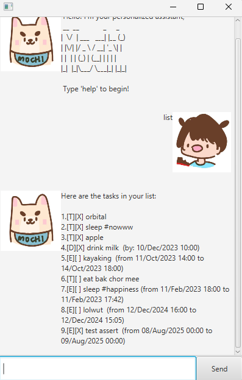

# Mochi User Guide

Mochi is a command-line-based task management tool that helps people track their to-dos, 
deadlines and events. Essentially, to-dos are just default tasks, deadlines come with
a specified end time, and events come with start and end times.



## Features

The following commands are supported in Mochi. use command `help` to access them any time.

1. **Add a Todo Task**

   - Command: `todo <description>`
   - Example:
     ```
     todo read book
     ```
   - parameters:
     - description: any string
   - Outcome: Adds a todo task with the given description.

2. **Add a Deadline Task**

   - Command: `deadline <description> /by <due date>`
   - Example:
     ```
     deadline submit assignment /by Sunday
     ```
   - parameters:
     - description: any string
     - due date: dateime in 'yyyy-MM-dd HHmm' format
   - Outcome: Adds a deadline task with the specified due date.

3. **Add an Event Task**

   - Command: `event <description> /from <start time> /to <end time>`
   - Example:
     ```
     event project meeting /from Mon 2pm /to Mon 4pm
     ```
   - parameters:
     - description: any string
     - start time: dateime in 'yyyy-MM-dd HHmm' format
     - end time: dateime in 'yyyy-MM-dd HHmm' format
   - Outcome: Adds an event task with the specified start and end times.

4. **List All Tasks**

   - Command: `list`
   - Example:
     ```
     list
     ```
   - Outcome: Displays all tasks with their details.

5. **Mark a Task as Completed**

   - Command: `mark <number>`
   - Example:
     ```
     mark 2
     ```
   - parameters:
       - number: non-negative integer starting from 1
   - Outcome: Marks the specified task as completed.

6. **Unmark a Task**

   - Command: `unmark <number>`
   - Example:
     ```
     unmark 2
     ```
   - parameters:
       - number: non-negative integer starting from 1
   - Outcome: Marks the specified task as incomplete.

7. **Find Tasks by Keyword**

   - Command: `find <word>`
   - Example:
     ```
     find book
     ```
   - parameters:
       - word: any string that can include white spaces
   - Outcome: Lists all tasks containing the given keyword.

8. **Tag a Task**

   - Command: `tag <number> <word>`
   - Example:
     ```
     tag 1 urgent
     ```
   - parameters:
     - word: any string that can include white spaces
   - Outcome: Adds a tag (e.g., `#urgent`) to the specified task.

9. **Untag a Task**

   - Command: `untag <number> <word>`
   - Example:
     ```
     untag 1 urgent
     ```
   - parameters:
       - word: any string that can include white spaces
   - Outcome: Removes the specified tag from the task.

10. **Exit the Program**
    - Command: `bye`
    - Example:
      ```
      bye
      ```
    - Outcome: Exits Mochi.

Refer to the examples above for the correct command formats and expected outcomes.

